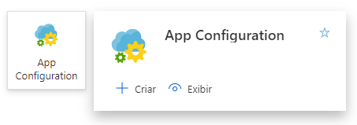
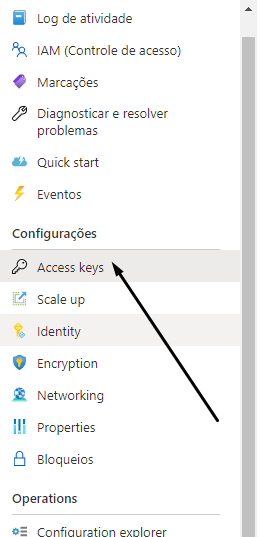
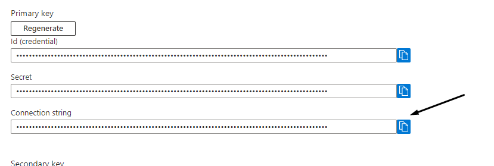
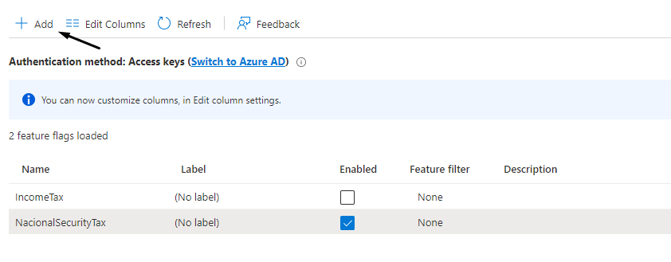
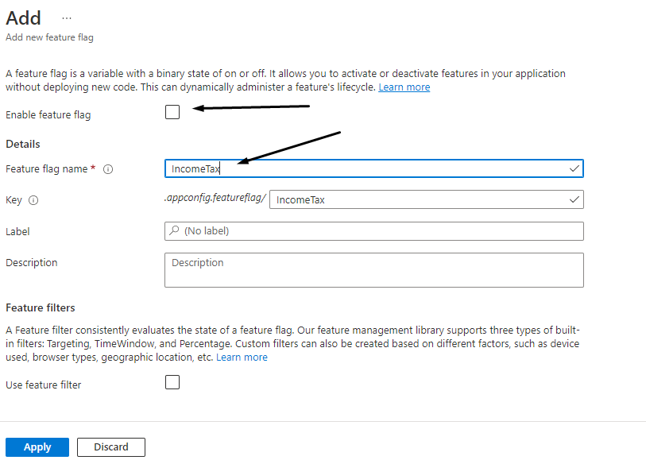
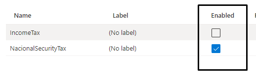

## Azure App Configuration PoC
This project is a Prove of the Concept to use Feature Manager in Azure App Configuration

### How-To:

##### Create the environment
Into a Resource Group, select to create a new App Configuration:



After this, we can get the App Configuration Connection String to include in our project. For it, we can go on "Access Key":



And copy the connection string, and paste in "appsettings.json" file:



##### Create Flags
In the feature manager menu and click on "Add" button:



And include the Flag informations:



And, starting now, you can control and see the flag on this column:



##### Configure our project

First we need to install the packages below:
* Microsoft.Azure.AppConfiguration.AspNetCore
* Microsoft.FeatureManagement

And then, we configure it into our Program file:

```csharp
using Microsoft.Extensions.Configuration;
using Microsoft.Extensions.DependencyInjection;
using Microsoft.Extensions.Hosting;
using Microsoft.FeatureManagement;

var buider = Host
    .CreateDefaultBuilder(args);

IConfiguration configuration = new ConfigurationBuilder()
    .AddJsonFile("appsettings.json")
    .Build();

buider
    .ConfigureAppConfiguration(cfg 
        => cfg.AddAzureAppConfiguration(opt 
            => opt.Connect(configuration.GetConnectionString("AppConfiguration")).UseFeatureFlags()));

buider.ConfigureServices(services =>
{
    services.AddAzureAppConfiguration();
    services.AddFeatureManagement();
});


var app = buider.Build();

await app.RunAsync();
```

And we can starting use it, calling the variable flag like this:
```csharp
await _featureManager.IsEnabledAsync("NacionalSecurityTax")
```

---


#### Refenreces:
* https://docs.microsoft.com/pt-BR/azure/azure-app-configuration/quickstart-aspnet-core-app?tabs=core6x
* https://docs.microsoft.com/pt-br/azure/azure-app-configuration/enable-dynamic-configuration-aspnet-core?tabs=core5x
* https://docs.microsoft.com/en-us/azure/azure-app-configuration/use-feature-flags-dotnet-core?tabs=core5x